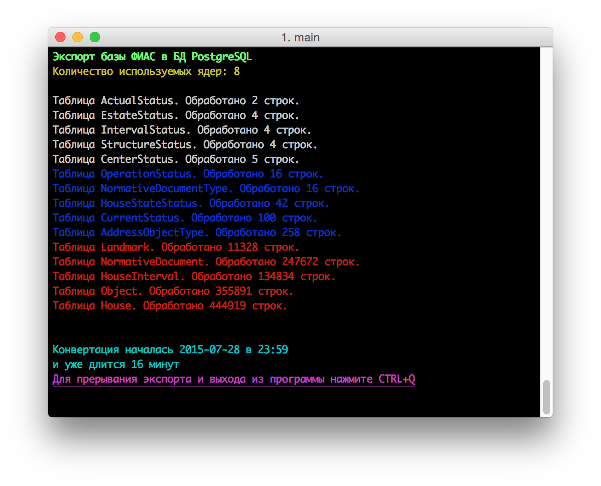

## Экспорт справочника ФИАС в БД PostgreSQL

[](https://godoc.org/github.com/pavlik/fias_xml2postgresql)

> ФИАС - Федеральная информационная адресная система

[ФИАС](http://fias.nalog.ru/Public/DownloadPage.aspx) выкладывает справочник адресов России в открытом доступе (и регулярно его обновляет). Но данные доступны всего в 2 форматах XML и DBF (FoxPro). В распакованом виде база весит около 20Гб. В таком формате не совсем удобно работать со справочником.

Для решения этой проблемы на [Go](http://golang.org/) была написана утилита экспортирующая данные из XML (в дальнейшем будет опция XML или DBF) в PostgreSQL.



## Установка
1. Скачайте утилиту
```
go get -u github.com/pavlik/fias_xml2postgresql
```
2. Перейдите в директорию с исходниками
```
cd $GOPATH/src/github.com/pavlik/fias_xml2postgresql
```
3. Скачайте все зависимости
```
go get -u
```
4. В этой директории создайте папку `xml` (позже будет создаваться автоматически).
5. Скачайте в директорию `xml` полный архив справочника в формате XML (позже будет скачиваться автоматически).
6. Создайте в PostgreSQL базу с именем fias принадлежащую пользователю dev с паролем dev. Или ваши данные, но тогда не забудьте изменить строку подключения в файле main.go
7. Запустите `go run main.go`

### Сделано:
* Сделать обработку таблиц многопоточной

### В планах:
* Вариант экспорта либо из XML, либо из DBF
* Добавить возможность автоматического скачивания архива с сайта ФИАС, распаковки и экспорта
* Добавить возможность автоматической проверки обновлений базы и автоматической установки, если требуется
* Проставить в схемах таблиц индексные поля
* Написать Makefile для автоматического создания таблицы fias и пользователя, для работы с ней
